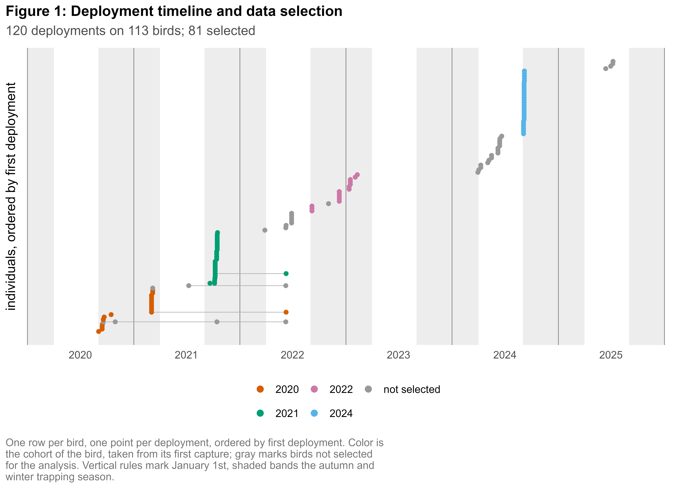
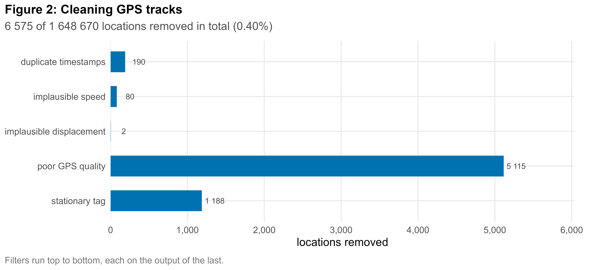
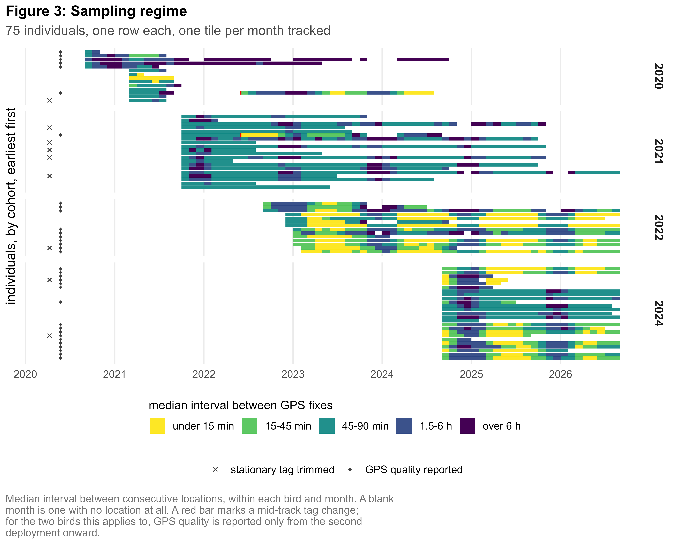
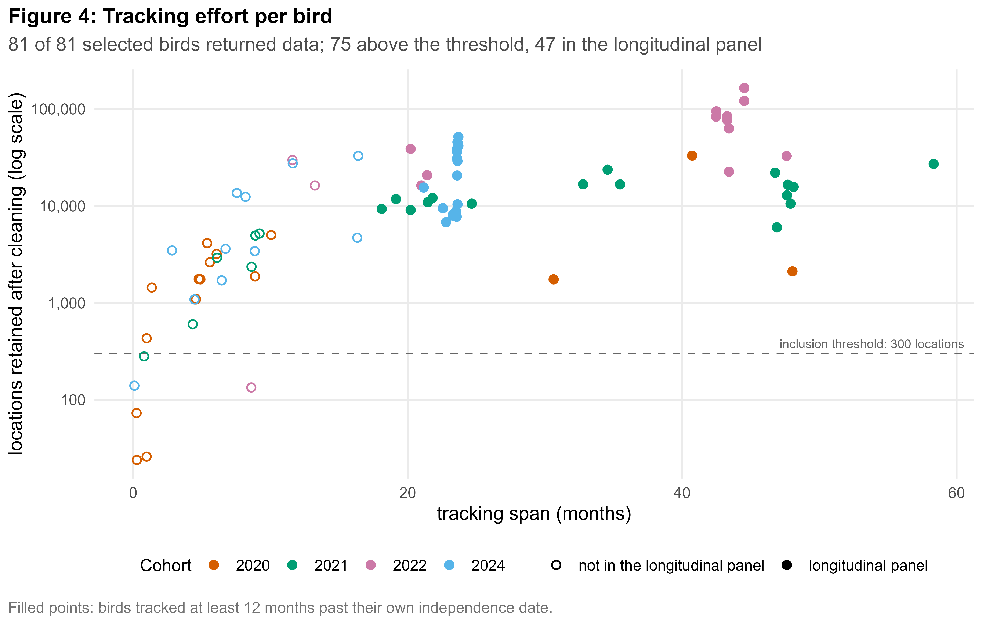
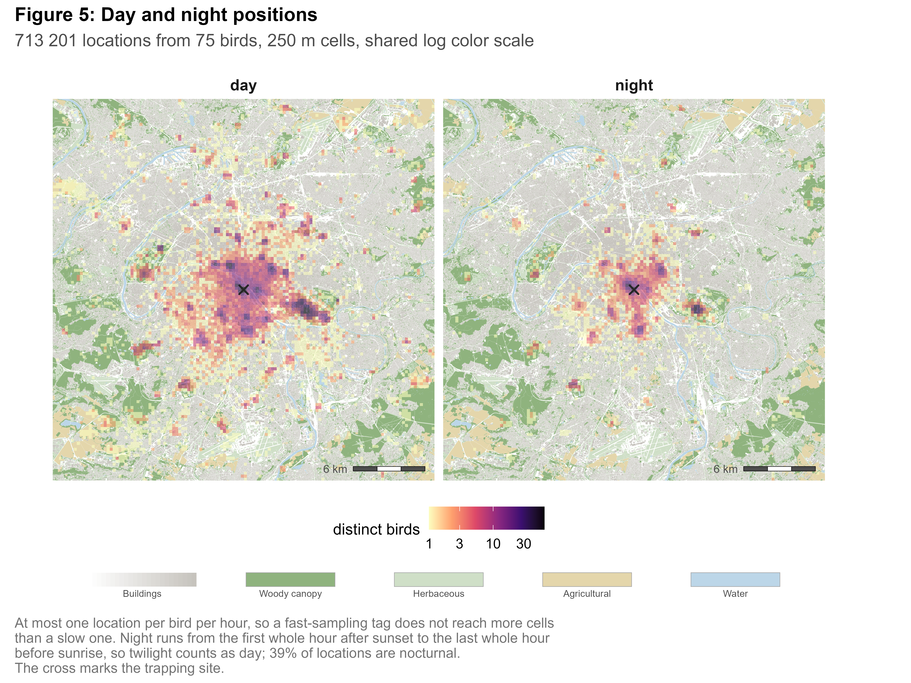
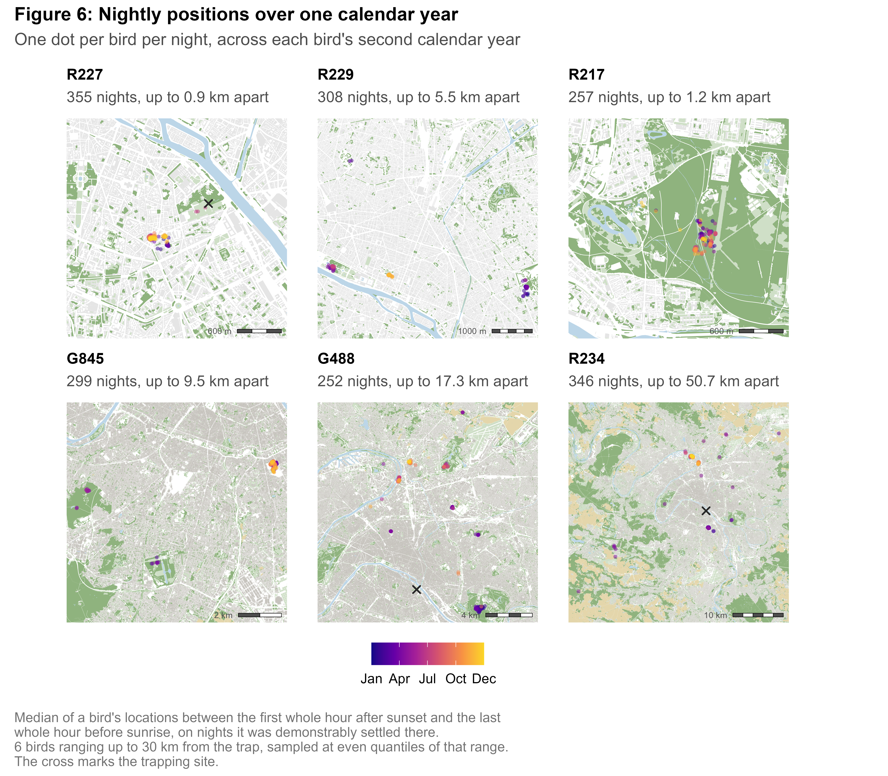
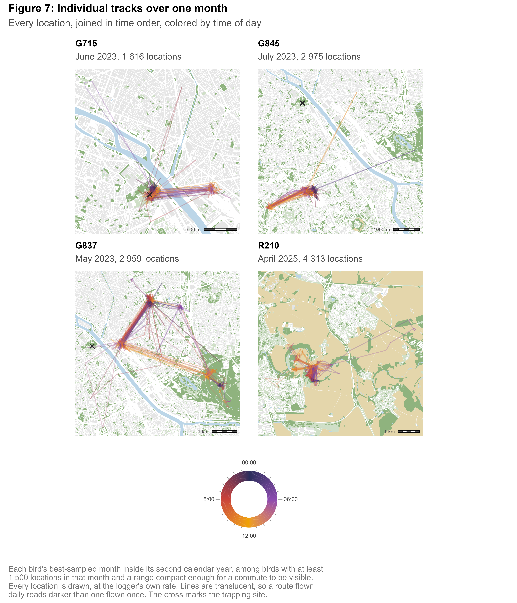
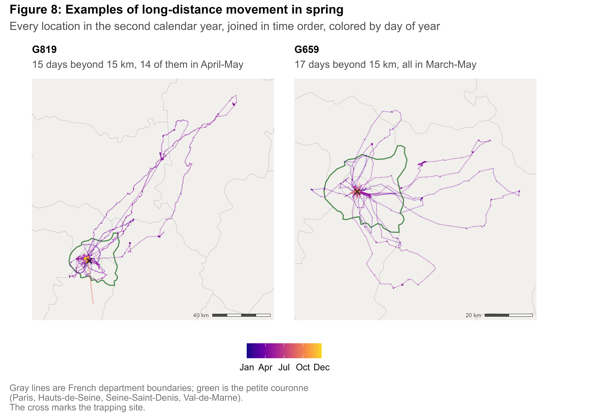
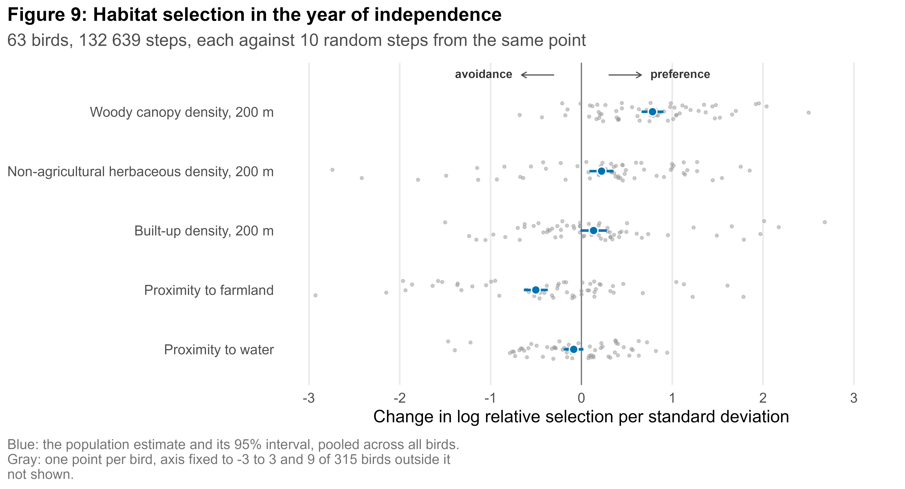
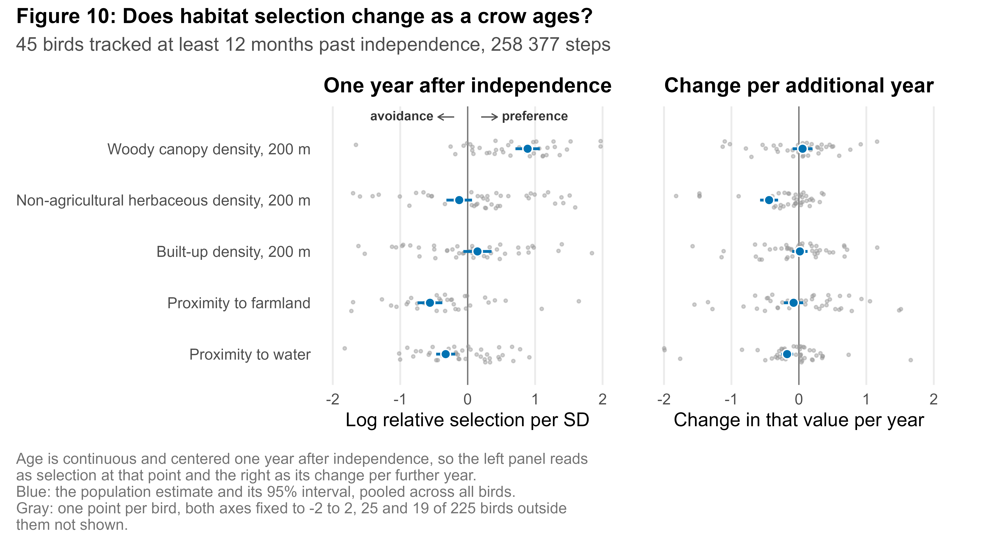

# Exploring the movements and habitat selection of GPS-tracked Parisian carrion crows

This personal project explores the dataset of GPS-tracked carrion crows associated with the 2025 study by Jiguet & Gantin ["Fission–fusion dynamics and spring movements in first-year carrion crows _Corvus corone_ challenge the efficiency of culling strategies"](https://doi.org/10.1038/s41598-025-17175-y), with the following objectives:
- understand telemetry and land-use data;
- learn about statistical models specific to animal ecology;
- practice writing analysis pipelines in R.

## Contents

- [Selecting and cleaning the GPS data](#selecting-and-cleaning-the-gps-data)
  - [Cohort selection](#cohort-selection)
  - [Cleaning](#cleaning)
  - [Sampling regime](#sampling-regime)
- [Visualizing the tracked birds' movements](#visualizing-the-tracked-birds-movements)
  - [Day and night positions](#day-and-night-positions)
  - [Visualizing individual tracks](#visualizing-individual-tracks)
- [Quantifying habitat selection](#quantifying-habitat-selection)
  - [Building the habitat covariates](#building-the-habitat-covariates)
  - [Step-selection function](#step-selection-function)
- [Pipeline](#pipeline)
- [Reproduce](#reproduce)
- [Limitations](#limitations-and-possible-extensions)
- [Use of AI assistance](#use-of-ai-assistance)
- [Data and licensing](#data-and-licensing)
- [Bibliography](#bibliography)

## Selecting and cleaning the GPS data

The dataset used contains the tracks of 113 carrion crows trapped, ringed and fitted with GPS loggers at the Jardin des Plantes in central Paris. It is freely accessible online:

[Movebank study 1266784970](https://www.movebank.org/cms/webapp?gwt_fragment=page=studies,path=study1266784970)
*Corvus corone [ID_PROG 883]*
PI Frédéric Jiguet (MNHN/CESCO)

### Cohort selection

The analysis is restricted to the individuals that the reference article identifies as first-year crows caught in the autumn or winter cage trap. Cohort (hatching year) is derived from the deployment date, and birds tagged outside that window, or flagged as rescued juveniles in the metadata, are automatically excluded.

5 birds that the rule would otherwise include are excluded by hand. Four are absent from the analysis of Jiguet & Gantin (2025) despite meeting the same criteria; the fifth is the sole bird the rule would assign to the 2023 cohort, which is absent from the article.

Note: The deployment date of one bird (G454) was manually corrected. Its GPS fixes started exactly one year later than recorded, consistent with a metadata error. The corrected date agrees with the cohort assigned to this bird in the reference article.



### Cleaning

The GPS tracks are cleaned using the following filters in order to remove implausible and imprecise samples:

| Filter                    | Description                                                                                                                                                                        |
| ------------------------- | ---------------------------------------------------------------------------------------------------------------------------------------------------------------------------------- |
| Duplicate timestamps      | Two records for the same bird at the same instant make step length undefined and speed infinite. Keeps the record with the better GPS quality (if available), otherwise the first. |
| Speed<br>> 65 km/h\*      | Above this a location is not physiologically plausible.                                                                                                                            |
| Displacement<br>> 50 km\* | Catches fixes that are isolated both in space and time from their neighbors.                                                                                                       |
| GPS quality               | Locations with HDOP above 5 (low horizontal precision) or fewer than 4 satellites (falling back to a 2D fix) are deemed imprecise.                                                 |
| Stationary tag            | Cuts the tail of a track if a tag stays still for a whole day (at least 5 fixes within a 100 m radius).                                                                            |
\*Location dropped when thresholds are exceeded on both the previous and following steps, as in Jiguet & Gantin (2025).

The figure below shows the effect of the different filters. The ratio of excluded locations remains low at 0.40%.



### Sampling regime

The interval between GPS fixes varies from under 15 minutes to over 6 hours. Figure 3 summarizes that information and shows that the sampling regime varies a lot between different deployments, probably due to the use of different GPS tagger models 



 Tracks with fewer than 300 locations are excluded, as in the reference study. Figure 4 shows the 6 birds out of 81 that are excluded by this threshold. The 47 birds tracked at least 12 months past their own independence date constitute a longitudinal panel that is later used to observe the effect of aging on habitat selection (see [Step-selection function](#step-selection-function)). 



## Visualizing the tracked birds' movements

Maps below share one basemap in Lambert-93 projection: OCS GE for woody, herbaceous and agricultural covers, with OpenStreetMap (OSM) buildings and water drawn on top (see [Building the habitat covariates](#building-the-habitat-covariates)). These features are mapped on a 62 x 62 km area centered around the trap. This area holds 99.4% of the dataset locations and the tracks of 55 of the 75 selected individuals are entirely contained in it.

### Day and night positions

Figure 5 shows the locations occupied by the selected crows during daytime and at night.  By day the birds spread diffusely across the whole city; by night they collapse onto a handful of tight aggregations.



Single positions per bird and per night were extracted from the GPS tracks: the median of each bird's nocturnal fixes, on nights it was demonstrably settled there (>50% locations within 100 m). Figure 6 shows examples of birds with different resident and disperser behavior during their second calendar year (i.e. cohort + 1). Only birds staying within the habitat study area are displayed. The spring dispersal described in the reference study seems visible in some of the panels. 



### Visualizing individual tracks

Figure 7 shows the best-sampled months of 4 different birds that stayed in the habitat study area. Different behaviors seem to emerge for the tracks.  G715 and G845 seem to mostly commute back and forth between two locations, one being the surroundings of their stable roost. They also show a handful of short trips to further locations but these are difficult to distinguish from possible localization errors when they are constituted by a single remote fix. In the tracks of G837 and R210, shuttling between more locations is visible, with some sites appearing to be visited at the same time of the day on multiple days.



15 of the 73 birds tracked during their second calendar year range beyond 40 km from the trap in that period, beyond the scope of the habitat study area. Figure 8 shows two examples of individuals exploring remote areas in spring. G819 goes on a 5-day+ trip in April, reaching 154 km from the trap. G659 multiplies shorter trips: 17 days out from March to May, none further than 68 km, always home again within 3 days.



## Quantifying habitat selection

### Building the habitat covariates

Habitat is described by 5 covariates on a shared 25 m grid. The layers used to build the covariates are those appearing on the basemap (see Figure 5). Each is built as either a distance to the nearest feature, for water and farmland, which form sparse, large areas, or a focal density within 200 m, for canopy, herbaceous cover and buildings, which form denser, smaller areas:

- **Proximity to farmland** — Derived from IGN OCS GE, usage `US1.1` (agricultural), excluding wooded couverture codes so a dense orchard or forestry plot reads as canopy rather than farmland. Defined as the negative logarithmic distance to the nearest cell: `-log1p(d)`.
- **Proximity to water** — Derived from OSM, `natural=water`. Same distance computation and `-log1p(d)` transform.
- **Woody canopy density** — IGN OCS GE couverture, wooded classes (`CS2.1.*`). Focal mean cover fraction within a 200 m circular kernel around each 25 m cell.
- **Non-agricultural herbaceous density** — IGN OCS GE couverture `CS2.2.1` (herbaceous), excluding usage `US1.1`. Same 200 m focal mean.
- **Built-up density** — OSM building footprints, rasterized to a 25 m cover fraction, then same 200 m focal mean.

The table below is the pairwise correlation among the five covariates; the worst pair, farmland against building density, is still reasonably low in magnitude (-0.56).

|                    | Farmland prox. | Water prox. | Canopy density | Herbaceous density | Building density |
| ------------------ | -------------: | ----------: | -------------: | -----------------: | ---------------: |
| Farmland prox.     |              — |       -0.21 |          -0.28 |              -0.36 |            -0.56 |
| Water prox.        |          -0.21 |           — |           0.07 |               0.14 |             0.02 |
| Canopy density     |          -0.28 |        0.07 |              — |              -0.24 |            -0.36 |
| Herbaceous density |          -0.36 |        0.14 |          -0.24 |                  — |             0.19 |
| Building density   |          -0.56 |        0.02 |          -0.36 |               0.19 |                — |

### Step-selection function

A step-selection function (SSF) compares each observed step against random steps available from the same point at the same moment. Here, fixes are restricted to daytime to avoid mixing up day and nighttime behaviors. Tracks are resampled to a target of one fix per hour (15-minute tolerance), cutting a new burst at any larger gap or day/night boundary. Parametric distributions of step lengths and turning angles are fitted to each bird's data (Avgar et al. 2016). Ten random steps are drawn per observed step, with lengths and turning angles taken from that bird's own fitted movement distribution. The comparison between the covariates at the actual steps and their values at the random steps is then fed to a conditional logistic regression. The resulting coefficients can be used to infer how the covariates influence that bird's movements. Models are fitted one bird at a time and pooled by random-effects meta-analysis, following the two-step approach in Muff et al. (2020).

Figure 9 displays the coefficient values computed on each bird's year of independence, from its own independence date to a year after it. Independence date was fixed at March 31st like in the reference paper. 12 birds with less than 100 usable steps in that window were excluded. The clearest signal is woody canopy density: one standard deviation more canopy multiplies relative selection by about 2.2 (coefficient 0.78, interval 0.66 to 0.90), closely followed by an avoidance of farmland (-0.50, -0.63 to -0.37, a multiplier of about 0.61). So steps seem to have favored locations closer to woody areas and further from farmland than availability would place them. Non-agricultural herbaceous density carries a modest preference (0.22, 0.09 to 0.35, a multiplier of about 1.25). Built-up density and proximity to water both cross zero (built-up: 0.13, -0.01 to 0.28; water: -0.08, -0.19 to 0.02). Between-bird heterogeneity accounts for 97% to 99% of the total variation in every term (I², Higgins & Thompson's statistic), i.e. their sampling error (how many steps each bird contributed) contributes to only 1-3% of the observed spread.



Next, new models were fitted on the whole tracks of the 47 birds in the longitudinal panel, using continuous age centered one year after independence as a covariate. 2 birds with less than 6 months of age spread among their usable steps were excluded, leaving 45 fitted models. Unlike the year-of-independence model above, which pools every step across that whole window into one coefficient per bird, this model fits a single continuous age trend per bird from its entire post-independence track and is then read at one specific point. Evaluated one year after independence, the left panel of Figure 10 lands close to what the year-of-independence model already found: canopy density is again the largest effect (0.89, 0.71 to 1.07, a multiplier of about 2.4), and proximity to farmland is again the largest avoidance (-0.56, -0.74 to -0.38).



The right panel of Figure 10 shows that only two covariates keep changing after one year of independence. This aging effect is limited to the first 3 years after independence since the number of birds tracked 2, 3 and 4 years after independence amount to 22, 18 and 1, respectively. Avoidance of water strengthens further (-0.17 per further year, -0.27 to -0.08). Non-agricultural herbaceous density, close to zero one year after independence (-0.13, -0.32 to 0.06), turns into a clear avoidance as birds age further (-0.44 per further year, -0.58 to -0.31). Canopy density, farmland avoidance and built-up density all cross zero on the right panel: the data do not show changes in the selection strength after one year of independence.

## Limitations and possible extensions

- **Interpretation of habitat selection.** Here the SSF was employed to get a broad picture of where the tracked crows spend their day. To produce more meaningful results, the choice of covariates, time windows and study area should be driven by more precise ecological questions and more in-depth knowledge of carrion crow behavior.
- **Sample limitation and bias on age influence.** Only 18 birds of the longitudinal panel are still tracked after 3 years and they do not constitute a random subset of those tagged. Age is not cleanly separable from calendar time in a dataset where all birds were caught at one site in a small number of seasons.
- **Location spikes filtering.** A single remote fix between two closer ones is difficult to distinguish from a GPS-localization error. Building a filter using neighboring step properties and/or altitude could help identify the most implausible ones.
- **Accelerometer-based activity is not used here.** Part of the fleet logs a single tri-axial accelerometer sample per GPS fix, a possible extension for a coarse activity proxy or for further GPS-data cleaning.
- **Improving canopy density covariate.** Using OSM's `natural=tree` category and City of Paris's managed-tree register could help refine IGN's OCS GE, which has a minimum mapping unit of 200 m² inside built-up areas.

## Pipeline

| Script                                                     | Role                                                                                                                     |
| ---------------------------------------------------------- | ------------------------------------------------------------------------------------------------------------------------ |
| [`00_setup.R`](scripts/00_setup.R)                         | Install packages; one-time Movebank credential setup                                                                     |
| [`01_download.R`](scripts/01_download.R)                   | Download deployments, select individuals by rule, fetch their GPS tracks                                                 |
| [`02_clean_gps.R`](scripts/02_clean_gps.R)                 | Re-key tracks by ring, plausibility filters, sampling-regime diagnostic                                                  |
| [`03_geodata_download.R`](scripts/03_geodata_download.R)   | Fetch both land-cover sources: the Geofabrik Île-de-France OSM extract (~316 MB) and IGN's OCS GE (~440 MB), both cached |
| [`04_covariates.R`](scripts/04_covariates.R)               | Build the building-density raster and the distance/density habitat stack, from OSM and OCS GE                            |
| [`05_settled_nights.R`](scripts/05_settled_nights.R)       | Extract one settled position per bird per night (median of nocturnal fixes), used by the maps below                      |
| [`06_maps.R`](scripts/06_maps.R)                           | Spatial visualizations: density maps, day against night, dispersal, individual tracks                                    |
| [`07_habitat_selection.R`](scripts/07_habitat_selection.R) | Fit the step-selection models                                                                                            |

Shared code sits in [`utils.R`](scripts/utils.R), [`plotting.R`](scripts/plotting.R), [`osm.R`](scripts/osm.R) and [`ocsge.R`](scripts/ocsge.R). All scope choices are defined in [`config.R`](config.R).

## Reproduce

```bash
Rscript scripts/00_setup.R
```

Once, interactively, to store Movebank credentials in the OS keychain rather than the repository:

```r
move2::movebank_store_credentials("your_movebank_username")
```

A Movebank account and a one-time license acceptance are required (`01_download.R` documents how). `DATA_CUTOFF` in `config.R` fixes the last date of GPS data kept, so the download stays reproducible even though the birds are still transmitting; set it to `NULL` to get all fixes up to run time. Scripts then run in numerical order:

```bash
Rscript scripts/01_download.R
Rscript scripts/02_clean_gps.R
Rscript scripts/03_geodata_download.R
# and so on...
```

`03_geodata_download.R` needs only `config.R`. All following scripts run offline. Geofabrik rebuilds its OSM extract nightly and it stays available for about 90 days. The script records the URL, checksum and snapshot date to the committed `data/processed/osm_provenance.csv`. To reproduce a past run, set `OSM$version` in `config.R` to this date.

## Use of AI assistance

I used Claude (Anthropic) throughout this project, for code generation, for drafting and editing text, and to become familiar with tools and concepts specific to ecology. The aim was to apply my existing skills in data science to this domain within a short time and to learn while doing it.

I am aware of AI's social and ecological costs, and I do not treat its increasing use as inevitable or unproblematic. Using it here was also a way to test its usefulness and limits for coding and scientific work.

The research question, the design choices, and the interpretation of the results are mine. I revised the code and the text through multiple iterations, and checked that the numbers and figures reported here can be regenerated by running the pipeline described above.

## Data and licensing

The **code** in this repository is BSD-3-Clause ([`LICENSE`](LICENSE)).

The **tracking data is not redistributed here.** It is distributed by Movebank under CC BY-NC, subject to the Movebank General Terms of Use, and is downloaded directly from Movebank by `01_download.R`. Raw and intermediate data directories are gitignored. OpenStreetMap data is ODbL and IGN's OCS GE is Etalab-licensed; both are also downloaded by the pipeline.

## Bibliography

- Jiguet, F. & Gantin, C. (2025). Fission–fusion dynamics and spring movements in first-year carrion crows *Corvus corone* challenge the efficiency of culling strategies. *Scientific Reports*, 15, 31068. https://doi.org/10.1038/s41598-025-17175-y
- Avgar, T., Potts, J.R., Lewis, M.A. & Boyce, M.S. (2016). Integrated step selection analysis: bridging the gap between resource selection and animal movement. *Methods in Ecology and Evolution*, 7, 619–630.
- Muff, S., Signer, J. & Fieberg, J. (2020). Accounting for individual-specific variation in habitat-selection studies: efficient estimation of mixed-effects models using Bayesian or frequentist computation. *Journal of Animal Ecology*, 89, 80–92.
